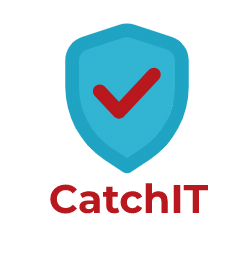

[](https://community.finos.org/docs/governance/Software-Projects/stages/archived)

This project is archived, which means that it's in read-only state; you can download and use this code, but please be aware that it may be buggy and may also contain security vulnerabilities. If you're interested to restore development activities on this project, please email help@finos.org.

# CatchIT Secret Scanner

Goldman Sachs has developed a simple yet powerful framework called CatchIT that can be easily integrated with CI/CD and provide information about confidential security violations in JSON output in stdout. It leverages the linux commands grep and find, so that the scanner has very low execution time. We have a predefined list of regular expressions for common sensitive files and secrets found in code which can be easily extended. The regexes have been created keeping in mind the rate of false positives.



## Dependencies
1. Python3
2. Bash (Leveraging linux commands- grep and find)

## TL; DR
1. Find the sensitive files (Certs, RSA keys, AWS credentials etc)
2. Search for the confidential Information in code (Passwords, AWS keys, Conn strings etc)

## Features
1. More regular expressions can be added to the file <i>regexs.json</i>
2. It is a CI/CD friendly tool as the median time for projects varying between 1000 and 10000 LoC is 0.3 seconds.
3. The scanner provides a functionality to keep a list of sample secrets keywords or false positives in a file inverse_grep.txt. This can be leveraged to escape commonly found patterns for the reduction of false positives.
4. The scanner also leverages Shannon entropy on the findings generated by the engine to have a boolean confidence, which can be leveraged to block/warn or keep it as informatory in the pipelines.
5. Regex with only a higher confidence will be blocked/warned  

## How to run?

```
python3 catchit.py --scan-path {Scan directory path}
```

## Contributing
For issue tracking, we use [GitHub Issues](https://github.com/finos/CatchIT/issues).

1. Fork it (<https://github.com/finos/CatchIT/fork>)
2. Create your feature branch (`git checkout -b feature/fooBar`)
3. Read our [contribution guidelines](.github/CONTRIBUTING.md) and [Community Code of Conduct](https://www.finos.org/code-of-conduct)
4. Commit your changes (`git commit -am 'Add some fooBar'`)
5. Push to the branch (`git push origin feature/fooBar`)
6. Create a new Pull Request

_NOTE:_ Commits and pull requests to FINOS repositories will only be accepted from those contributors with an active, executed Individual Contributor License Agreement (ICLA) with FINOS OR who are covered under an existing and active Corporate Contribution License Agreement (CCLA) executed with FINOS. Commits from individuals not covered under an ICLA or CCLA will be flagged and blocked by the FINOS Clabot tool. Please note that some CCLAs require individuals/employees to be explicitly named on the CCLA.

*Need an ICLA? Unsure if you are covered under an existing CCLA? Email [help@finos.org](mailto:help@finos.org)*


## License

Copyright 2021 Goldman Sachs

Distributed under the [Apache License, Version 2.0](http://www.apache.org/licenses/LICENSE-2.0).

SPDX-License-Identifier: [Apache-2.0](https://spdx.org/licenses/Apache-2.0)
